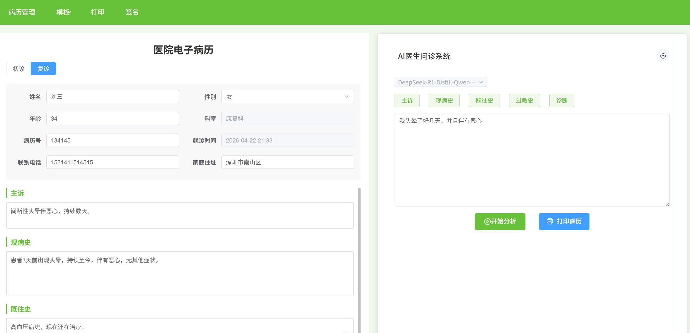
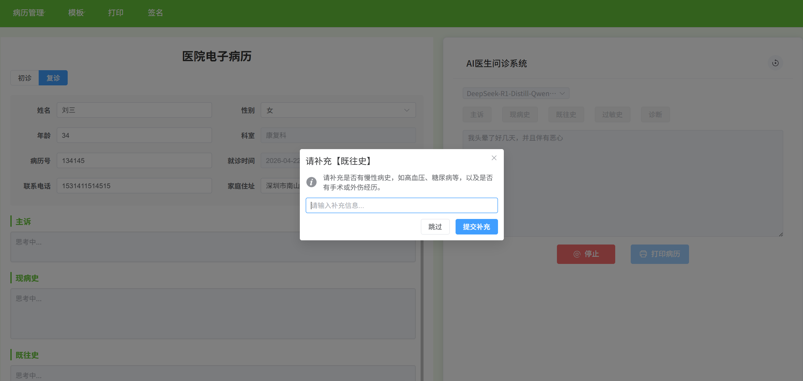

# LLM 病历智能撰写系统

[](LICENSE)
[](https://vuejs.org/)
[](https://fastapi.tiangolo.com/)

> 基于大语言模型（LLM）的电子病历智能生成系统。输入患者口语化描述，自动提取结构化病历信息（主诉、现病史、既往史、过敏史、诊断），支持多轮补充问答与单字段重新提取，并一键导出标准格式病历文档。

----

## 目录

- [核心功能](#核心功能)
- [截图预览](#截图预览)
- [技术栈](#技术栈)
- [项目结构](#项目结构)
- [快速开始](#快速开始)
- [核心 API](#核心-api)
- [环境变量配置](#环境变量配置)
- [开发注意事项](#开发注意事项)
- [许可证](#许可证)

---

## 核心功能

- **智能信息提取**：利用 LLM 从自然语言描述中自动提取五大结构化病历字段（主诉、现病史、既往史、过敏史、诊断）。
- **多轮补充交互**：当信息不足时，系统会智能追问，用户补充相关信息后继续生成完整病历。
- **单字段重新提取**：支持点击任意医疗字段按钮（如"主诉"、"诊断"），针对该字段单独重新分析或修正。
- **患者信息表单编辑**：左侧病历面板支持直接编辑患者姓名、性别、年龄、联系方式等基本信息。
- **Word 文档导出**：后端基于 `python-docx` 生成符合规范的病历 Word 文档，支持浏览器直接下载。
- **本地病历保存**：支持将当前病历保存到浏览器，最多保留最近 20 条历史记录。
- **请求取消支持**：分析过程中可随时点击"停止"按钮取消正在进行的 LLM 请求。
- **双栏交互界面**：左侧为电子病历表单，右侧为 AI 输入与分析面板，数据实时同步。

---

## 截图预览

**1. 主页面**：

<div align="center">
  
</div>

**2. 补充询问**：

<div align="center">
  
</div>

----

## 技术栈

| 层级 | 技术选型 | 说明 |
| --- | --- | --- |
| **后端** | Python + FastAPI + Pydantic v2 | 提供 RESTful API，负责 LLM 调用、会话管理与文档生成 |
| **前端** | Vue 3 (Composition API) + Vite + Element Plus | 提供响应式双栏交互界面，支持请求取消与状态管理 |
| **LLM 服务** | SiliconFlow API（OpenAI 兼容） | 默认使用 `Qwen/Qwen3.5-4B` 模型 |
| **会话管理** | 自定义 `SessionStore` + `asyncio.Lock` | 支持 per-session 字段级历史记录、TTL 过期清理与 LRU 上限控制 |
| **文档生成** | `python-docx` (Word) / `html2canvas` + `jsPDF` (PDF) | 支持两种导出格式，后端失败时前端自动 fallback |

---

## 项目结构

```
LLM-medical-records/
├── backend/                         # FastAPI 后端
│   ├── server.py                    # 服务入口，定义 /process、/supplement、/generate_doc
│   ├── function.py                  # LLM 调用、字段提取、会话存储核心逻辑
│   ├── chat_memory.py               # 基于字段的会话历史管理（MedicalHistoryManager）
│   ├── med_prompt.py                # 各字段的系统/用户 Prompt 模板
│   ├── schemas.py                   # Pydantic 数据模型
│   ├── config.py                    # Pydantic v2 Settings 配置读取
│   ├── .env                         # 环境变量（需本地配置）
│   ├── .env.example                 # 环境变量模板
│   ├── test_workflow.py             # 完整工作流测试
│   ├── test_generate_doc.py         # 文档生成测试
│   ├── test_unit.py                 # 单元测试（字段状态、历史记录、输入注入等）
│   └── test_full_workflow.py        # 端到端工作流测试
├── frontend/                        # Vue 3 前端
│   ├── src/
│   │   ├── api/
│   │   │   └── medical.js           # 统一封装的 API 调用层
│   │   ├── components/
│   │   │   ├── AppHeader.vue        # 顶部菜单栏（病历管理/模板/打印/签名）
│   │   │   ├── PatientInfo.vue      # 左侧病历表单（患者信息 + 医疗内容）
│   │   │   ├── AIMedicalPanel.vue   # 右侧 AI 分析面板（输入/分析/打印）
│   │   │   └── PrintTemplate.vue    # PDF 打印模板
│   │   ├── App.vue
│   │   └── main.js
│   ├── package.json
│   └── vite.config.js
│
├── requirements.txt                 # Python 依赖清单
├── .gitignore
├── LICENSE
└── README.md
```

---

## 快速开始

### 1. 克隆仓库

```bash
git clone https://github.com/LtxChara/LLM-medical-records.git
cd LLM-medical-records
```

### 2. 配置后端环境

**方式一：使用 Conda（推荐）**

```bash
conda create -n medicRecords python=3.10
conda activate medicRecords
pip install -r requirements.txt
```

**方式二：使用 venv**

```bash
cd backend
python -m venv venv

# Windows
venv\Scripts\activate
# macOS / Linux
source venv/bin/activate

cd ..
pip install -r requirements.txt
```

**配置环境变量**

```bash
cp backend/.env.example backend/.env
# 编辑 backend/.env，填入你的 API Key
```

### 3. 启动后端服务

```bash
cd backend
python server.py
```

后端服务默认运行在 `http://localhost:5000`。

> **注意**：`server.py` 已配置 CORS 白名单，默认允许来自 `http://localhost:5173` 和 `http://localhost:5174` 的跨域请求。若前端运行在其他端口，请在 `server.py` 的 `allowed_origins` 中补充对应地址。

### 4. 配置并启动前端

```bash
cd frontend
npm install
npm run dev
```

前端开发服务器默认运行在 `http://localhost:5173`，打开浏览器即可使用。

### 5. 生产构建

```bash
cd frontend
npm run build
```

构建产物将输出到 `frontend/dist/` 目录。

---

## 核心 API

后端提供以下三个核心接口：

### `POST /process`

启动病历分析流程。

**请求体**：

```json
{
  "session_id": "uuid-string",
  "text": "患者头晕、乏力三天，伴有恶心..."
}
```

**响应状态**：

- `success`：所有字段提取完成，返回结构化结果。
- `incomplete`：某个字段信息不足，返回需要补充的字段名与问题。
- `error`：处理过程中发生错误。

### `POST /supplement`

补充缺失信息，继续生成病历。

**请求体**：

```json
{
  "session_id": "uuid-string",
  "field": "现病史",
  "text": "患者没有发热，但有轻微咳嗽..."
}
```

### `POST /generate_doc`

根据当前病历数据生成 Word 文档并下载。

**请求体**：

```json
{
  "input": {
    "patient_info": { "name": "...", "gender": "...", "age": "..." },
    "visit_info": { "visit_date": "...", "department": "...", "doctor": "..." },
    "medical_content": { "主诉": "...", "现病史": "...", "既往史": "...", "过敏史": "...", "诊断": "..." }
  }
}
```

---

## 环境变量配置

复制 `backend/.env.example` 为 `backend/.env`，并根据实际情况填写：

| 变量名 | 说明 | 默认值 |
| --- | --- | --- |
| `API_KEY` | **必填**，你的 API Key | `your_api_key_here` |
| `BASE_URL` | API 基础地址 | `https://api.siliconflow.cn/v1` |
| `LLM_MODEL_NAME` | 使用的模型名称 | `Qwen/Qwen3.5-4B` |
| `LLM_TIMEOUT` | LLM 请求超时时间（秒） | `30.0` |
| `LLM_MAX_RETRIES` | 请求失败最大重试次数 | `2` |
| `SESSION_TTL_SECONDS` | 会话缓存过期时间（秒） | `3600` |

> **注意**：`backend/.env` 包含敏感信息，已被 `.gitignore` 排除，请勿将其提交到仓库。

---

## 开发注意事项

### 端口占用

后端默认使用 `5000` 端口。若启动时报 `Errno 10048`（端口已被占用），请检查是否有残留 Python 进程仍在监听该端口，并将其终止后重试。

### CORS 配置

若前端实际运行端口与后端白名单不一致（如 Vite 自动分配了 `5174` ），会导致浏览器 CORS 拦截。请修改 `backend/server.py` 中的 `allowed_origins` 列表，加入实际的前端 Origin。

### 后端热重载

生产环境或稳定测试时，建议将 `server.py` 中的 `reload` 设为 `False`，以避免 `watchfiles` 因日志文件写入而频繁触发检测。开发环境如需热重载，可通过 `reload_excludes` 排除日志和输出目录：

```python
uvicorn.run(
    "server:app",
    host="0.0.0.0",
    port=5000,
    reload=True,
    reload_excludes=["*.log", "*.docx", "test_outputs"]
)
```

### 测试

```bash
# 后端单元测试
cd backend
python test_unit.py

# 后端端到端测试
python test_full_workflow.py

# 文档生成测试
python test_generate_doc.py
```

---

## 许可证

本项目基于 [MIT License](LICENSE) 开源，你可以自由学习、修改和分发。

```
MIT License

Copyright (c) 2026 Tianxiang Li

Permission is hereby granted, free of charge, to any person obtaining a copy
of this software and associated documentation files (the "Software"), to deal
in the Software without restriction, including without limitation the rights
to use, copy, modify, merge, publish, distribute, sublicense, and/or sell
copies of the Software, and to permit persons to whom the Software is
furnished to do so, subject to the following conditions:

The above copyright notice and this permission notice shall be included in all
copies or substantial portions of the Software.
```

---

> 如果你在学习过程中有任何问题，欢迎提交 [Issue](https://github.com/[YourUsername]/MusicPlayer4/issues) 或 [Pull Request](https://github.com/[YourUsername]/MusicPlayer4/pulls)。祝你学习愉快！
>
> ⭐ 如果这个项目对你有帮助，欢迎 Star 支持！
