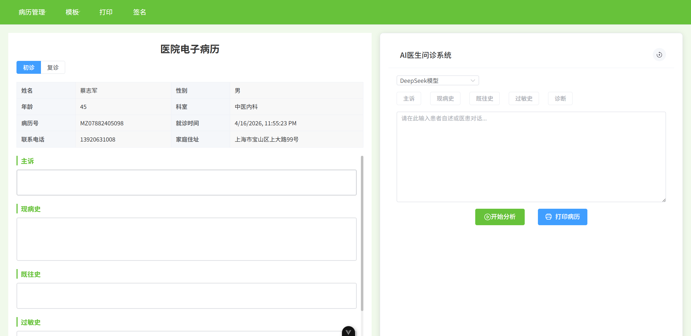

# LLM 病历智能撰写系统

[](LICENSE)
[](https://vuejs.org/)
[](https://fastapi.tiangolo.com/)

> 基于大语言模型（LLM）的电子病历智能生成系统。输入患者口语化描述，自动提取结构化病历信息（主诉、现病史、既往史、过敏史、诊断），支持多轮补充问答，并一键导出标准格式病历文档。



---

## 目录

- [功能特性](#功能特性)
- [技术架构](#技术架构)
- [项目结构](#项目结构)
- [快速开始](#快速开始)
- [核心 API](#核心-api)
- [环境变量配置](#环境变量配置)
- [开发文档](#开发文档)
- [许可证](#许可证)

---

## 功能特性

- **智能信息提取**：利用 LLM 从自然语言描述中自动提取五大结构化病历字段。
- **多轮补充交互**：当信息不足时，系统会智能追问，用户补充相关信息后继续生成完整病历。
- **Word 文档导出**：后端基于 `python-docx` 生成符合规范的病历 Word 文档，支持浏览器直接下载。
- **前端 PDF 导出**：前端基于 `html2canvas` + `jsPDF` 生成 A4 尺寸 PDF，便于本地打印与预览。
- **双栏交互界面**：左侧为电子病历表单，右侧为 AI 输入与分析面板，数据实时同步。

---

## 技术架构

| 层级               | 技术选型                                                   | 说明                                                |
| ------------------ | ---------------------------------------------------------- | --------------------------------------------------- |
| **后端**     | Python + FastAPI + Pydantic                                | 提供 RESTful API，负责 LLM 调用、会话管理与文档生成 |
| **前端**     | Vue 3 (Composition API) + Vite + Element Plus              | 提供响应式双栏交互界面                              |
| **LLM 服务** | SiliconFlow API                                            | 默认使用 `Qwen/Qwen3.5-4B` 模型                   |
| **文档生成** | `python-docx` (Word) / `html2canvas` + `jsPDF` (PDF) | 支持两种导出格式                                    |

---

## 项目结构

```
LLM-medical-records/
├── backend/                    # FastAPI 后端
│   ├── server.py               # 服务入口，定义 /process、/supplement、/generate_doc
│   ├── function.py             # LLM 调用与病历字段提取核心逻辑
│   ├── chat_memory.py          # 基于字段的会话历史管理
│   ├── med_prompt.py           # 各字段的 Prompt 模板
│   ├── schemas.py              # Pydantic 数据模型
│   ├── config.py               # 配置读取
│   ├── .env.example            # 环境变量模板（需复制为 .env 后使用）
│   ├── test_workflow.py        # 完整工作流测试
│   └── test_generate_doc.py    # 文档生成测试
├── frontend/                   # Vue 3 前端
│   ├── src/
│   │   ├── api/
│   │   │   └── medical.js      # 统一封装的 API 调用层
│   │   ├── components/
│   │   │   ├── AppHeader.vue   # 顶部菜单栏
│   │   │   ├── PatientInfo.vue # 左侧病历表单
│   │   │   ├── AIMedicalPanel.vue  # 右侧 AI 分析面板
│   │   │   └── PrintTemplate.vue   # PDF 打印模板
│   │   ├── App.vue
│   │   └── main.js
│   ├── package.json
│   └── vite.config.js
├── CLAUDE.md                   # 项目开发维护文档（供协作者参考）
├── requirements.txt
├── .gitignore
├── LICENSE
└── README.md
```

---

## 快速开始

### 1. 克隆仓库

```bash
git clone https://github.com/LtxChara/LLM-medical-records.git
cd LLM-medical-records
```

### 2. 配置后端环境

```bash
# 创建虚拟环境（推荐）
cd backend
python -m venv venv

# Windows
venv\Scripts\activate
# macOS / Linux
source venv/bin/activate

# 安装依赖
cd ..
pip install -r requirements.txt

# 配置环境变量
cp backend/.env.example backend/.env
# 编辑 backend/.env，填入你的 API Key
```

### 3. 启动后端服务

```bash
cd backend
python server.py
```

后端服务默认运行在 `http://localhost:5000`，并自动允许 `http://localhost:5173` 的跨域请求。

### 4. 配置并启动前端

```bash
cd frontend
npm install
npm run dev
```

前端开发服务器默认运行在 `http://localhost:5173`，打开浏览器即可使用。

### 5. 生产构建

```bash
cd frontend
npm run build
```

构建产物将输出到 `frontend/dist/` 目录。

---

## 核心 API

后端提供以下三个核心接口：

### `POST /process`

启动病历分析流程。

**请求体**：

```json
{
  "session_id": "uuid-string",
  "text": "患者头晕、乏力三天，伴有恶心..."
}
```

**响应状态**：

- `success`：所有字段提取完成，返回结构化结果。
- `incomplete`：某个字段信息不足，返回需要补充的字段名与问题。
- `error`：处理过程中发生错误。

### `POST /supplement`

补充缺失信息，继续生成病历。

**请求体**：

```json
{
  "session_id": "uuid-string",
  "field": "现病史",
  "text": "患者没有发热，但有轻微咳嗽..."
}
```

### `POST /generate_doc`

根据当前病历数据生成 Word 文档并下载。

**请求体**：

```json
{
  "input": {
    "patient_info": { "name": "...", "gender": "...", "age": "..." },
    "visit_info": { "visit_date": "...", "department": "...", "doctor": "..." },
    "medical_content": { "主诉": "...", "现病史": "...", ... }
  }
}
```

---

## 环境变量配置

复制 `backend/.env.example` 为 `backend/.env`，并根据实际情况填写：

| 变量名                   | 说明                           | 默认值                            |
| ------------------------ | ------------------------------ | --------------------------------- |
| `SILICONFLOW_API_KEY`  | **必填**，你的  API Key | `your_api_key_here`             |
| `SILICONFLOW_BASE_URL` | API 基础地址                   | `https://api.siliconflow.cn/v1` |
| `LLM_MODEL_NAME`       | 使用的模型名称                 | `Qwen/Qwen3.5-4B`               |
| `LLM_TIMEOUT`          | LLM 请求超时时间（秒）         | `30.0`                          |
| `LLM_MAX_RETRIES`      | 请求失败最大重试次数           | `2`                             |
| `SESSION_TTL_SECONDS`  | 会话缓存过期时间（秒）         | `3600`                          |

> **注意**：`backend/.env` 包含敏感信息，已被 `.gitignore` 排除，请勿将其提交到仓库。

---

## 许可证

本项目基于 [MIT License](LICENSE) 开源，欢迎自由学习、修改与复用。
